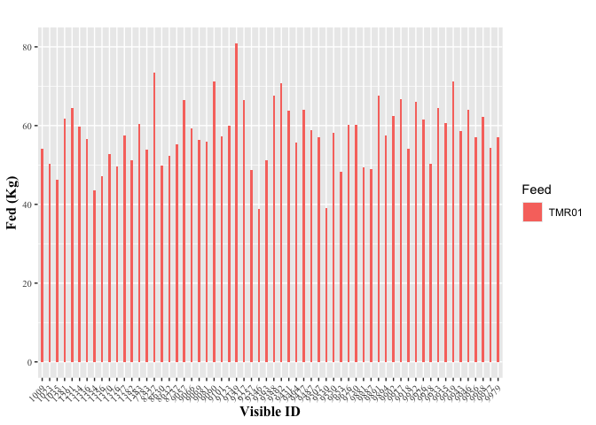

<!-- README.md is generated from README.Rmd. Please edit that file -->

# feedeffir

<!-- badges: start -->
<!-- badges: end -->

The goal of feedeffir is to process feed efficiency files and calculate
total dry matter intake, metabolic body weight, delta body weight, and
milk energy.

## Installation

You can install the development version of feedeffir from
[GitHub](https://github.com/) with:

``` r
# install.packages("pak")
pak::pak("GMBog/feedeffir")
```

feedeffir handles two main types of data:

1.  **Raw Data**:
    - **Description**: This includes unprocessed datasets directly from
      the farm. Examples are raw milk weights from DC and AFI system,
      feed intake files from RIC2 Discover system, and milk composition
      files.
    - **Usage**: Functions that operate on raw data are designed for
      pre-processing and compilation.
2.  **Compiled Feed Efficiency Data**:
    - **Description**: This includes compiled datasets from raw data and
      include metrics such as milk weights, milk composition, and feed
      intakes.
    - **Usage**: Functions targeting compiled files focus on analyzing
      feed efficiency traits. They require data that has already been
      processed from raw inputs.

### How to Use

To work with **raw data**, use functions to preprocess and create the
initial data sets:

- `process_VRfiles()`
- `process_DC_milkw()`
- `process_AFI_milkw()`

To compile data, use the `compiler()` function with different types of
files (body weights, milk weights, milk composition, and VR).

To analyze **compiled feed efficiency files**, use functions which
expect compiled data:

- `process_bw()`
- `process_intakes()`
- `calculate_milke()`

For detailed examples of how to use these functions, refer to the
[Examples](#examples) section.

## Examples

This is a basic example which shows you how to solve a common problem:

``` r
library(feedeffir)

# Process VR files with intakes
data <- process_VRfiles(
  exp = "Study1",
  VRfile = system.file("extdata", "VR240724.DAT", package = "feedeffir"),
  bins = seq(1, 32),
  save_dir = tempdir()
)
#> The VR file was processed and the result saved at /var/folders/8n/lmf4l1hs7jz2m86j5g16k21c0000gn/T//RtmpTQwVbw
```



``` r

head(data)
#> # A tibble: 6 × 6
#>   TrialID Date       Visible_ID Feed  FedKg Obs  
#>   <chr>   <date>          <dbl> <chr> <dbl> <lgl>
#> 1 Study1  2024-07-24       1009 TMR01  54.1 NA   
#> 2 Study1  2024-07-24       1023 TMR01  50.2 NA   
#> 3 Study1  2024-07-24       1035 TMR01  46.2 NA   
#> 4 Study1  2024-07-24       1281 TMR01  61.7 NA   
#> 5 Study1  2024-07-24       1291 TMR01  64.5 NA   
#> 6 Study1  2024-07-24       1334 TMR01  59.7 NA

# The next step is to compile the processed VR files
# compile_VRfiles(dir = "~/Downloads/files/",
#                compfile = "UW_Study1_CompiledIntakes.xlsx",
#                data = data)


# Process milk weights from Dairy Comp
data <- process_DC_milkw(exp = "Study1", 
                         file_path = system.file("extdata", "MilkWeight_DCfile.xls", package = "feedeffir"), 
                         save_dir = tempdir())
#> Number of cows in file: 64
#> Time range:
#> 2024-09-14
#> 2024-09-13
#> 2024-09-12
#> 2024-09-11
#> 2024-09-10
#> 2024-09-09
#> 2024-09-08
#>    Min. 1st Qu.  Median    Mean 3rd Qu.    Max. 
#>    0.00   45.00   53.00   52.88   62.00   89.00

head(data)
#>   Trial_ID       Date MilkNum Visible_ID MilkLbs
#> 1   Study1 2024-09-14      PM       1001      66
#> 2   Study1 2024-09-14      PM       1068      53
#> 3   Study1 2024-09-14      PM       1069      51
#> 4   Study1 2024-09-14      PM       1074      57
#> 5   Study1 2024-09-14      PM       1092      49
#> 6   Study1 2024-09-14      PM       1097      44
```
